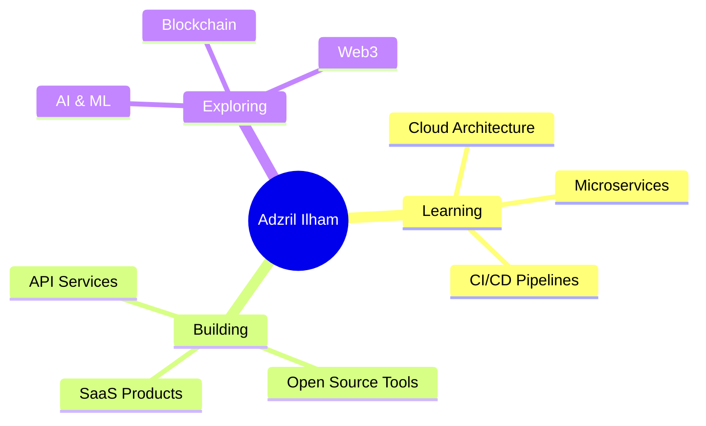

<div align="center">
  
  <!-- Animated Header -->
  

  <!-- Typing Animation dengan Multiple Lines -->
  <a href="https://git.io/typing-svg">
    
  </a>
  
  <br/>
  
  <!-- Badges -->
  
  
  

</div>

<br/>

<!-- About Me Section with Gradient -->
<div align="center">
  
</div>

##  About Me

```typescript
class AdzrilIlham extends Developer {
  constructor() {
    super();
    this.name = "Adzril Ilham";
    this.location = "🇮🇩 Bandung, West Java, Indonesia";
    this.role = "Full Stack Developer";
    this.languages = ["JavaScript", "PHP", "Python", "C++"];
  }

  get workingOn(): string[] {
    return [
      "🔭 Building scalable web applications",
      "🌱 Exploring microservices architecture",
      "💡 Contributing to open source"
    ];
  }

  get skills(): TechStack {
    return {
      frontend: ["HTML5", "CSS3", "JavaScript", "Tailwind", "Bootstrap"],
      backend: ["Laravel", "Django", "Flask", "RESTful APIs"],
      database: ["MySQL", "PostgreSQL", "MongoDB", "Redis"],
      devOps: ["Docker", "Git", "GitHub Actions", "Vercel"],
      tools: ["VS Code", "Postman", "Figma", "Prettier"]
    };
  }

  get motto(): string {
    return "Code is poetry written in logic 🎨✨";
  }

  dailyRoutine(): void {
    while (alive) {
      eat();
      sleep();
      code();
      repeat();
    }
  }
}
```

<div align="center">
  
  **💬 Ask me about:** `Laravel` `Python` `Web Development` `APIs` `Database Design`
  
  **⚡ Fun fact:** I can debug faster with `console.log()` than with actual debuggers! 😄
  
  **🎯 2025 Goals:** Contribute more to Open Source & Master Cloud Architecture ☁️
  
</div>

---

<!-- Animated Divider -->


## 🏆 GitHub Profile Trophy

<div align="center">
  
  [](https://github.com/ryo-ma/github-profile-trophy)
  
</div>

---

## 📊 GitHub Analytics

<div align="center">
  
  
</div>

<div align="center">
  
  
</div>

<!-- Contribution Graph -->
<div align="center">
  
</div>

---

<!-- Animated Divider -->


## 💻 Tech Stack & Tools

<div align="center">

### 🎨 Frontend Development


### 🔥 Backend Development


### 💾 Database & Cloud


### 🛠️ Tools & Platforms


### 📚 Programming Languages


</div>

---

<!-- Animated Divider -->


## 🐍 Watch My Contributions Get Eaten!

<div align="center">
  <picture>
    <source media="(prefers-color-scheme: dark)" srcset="https://raw.githubusercontent.com/AdzrilIlham/AdzrilIlham/output/github-contribution-grid-snake-dark.svg">
    <source media="(prefers-color-scheme: light)" srcset="https://raw.githubusercontent.com/AdzrilIlham/AdzrilIlham/output/github-contribution-grid-snake.svg">
    
  </picture>
</div>

---

## 📈 Contribution Stats

<div align="center">

<table>
  <tr>
    <td>
      
    </td>
  </tr>
  <tr>
    <td>
      
    </td>
    <td>
      
    </td>
  </tr>
  <tr>
    <td>
      
    </td>
    <td>
      
    </td>
  </tr>
</table>

</div>

---

<!-- Animated Divider -->


## 🌟 Featured Projects

<div align="center">

<a href="https://github.com/AdzrilIlham/project1">
  
</a>

<a href="https://github.com/AdzrilIlham/project2">
  
</a>

</div>

---

## 💭 Developer Quote of the Day

<div align="center">


</div>

---

<!-- Animated Divider -->


## 🤝 Connect With Me

<div align="center">

[](https://linkedin.com/in/yourprofile)
[](https://twitter.com/yourprofile)
[](https://instagram.com/yourprofile)
[](https://yourportfolio.com)
[](mailto:your.email@example.com)
[](https://discord.gg/yourdiscord)
[](https://t.me/yourtelegram)
[](https://wa.me/yournumber)

</div>

---

## 📊 Weekly Development Breakdown

<!--START_SECTION:waka-->
<!--END_SECTION:waka-->

---

## 🎯 Current Focus

<div align="center">



</div>

---

## 🎮 When I'm Not Coding...

<div align="center">

| 🎵 Music | 📚 Reading | 🎮 Gaming | ☕ Coffee |
|----------|-----------|-----------|----------|
|  |  |  |  |

</div>

---

## 💖 Support My Work

<div align="center">

If you like what I do, maybe consider buying me a coffee/tea 🥺👉👈

[](https://www.buymeacoffee.com/yourprofile)
[](https://ko-fi.com/yourprofile)
[](https://paypal.me/yourprofile)

</div>

---

<div align="center">

### 🌟 Show Some Love by Starring My Repos! 🌟


### ✨ Made with ❤️ by Adzril Ilham


</div>
